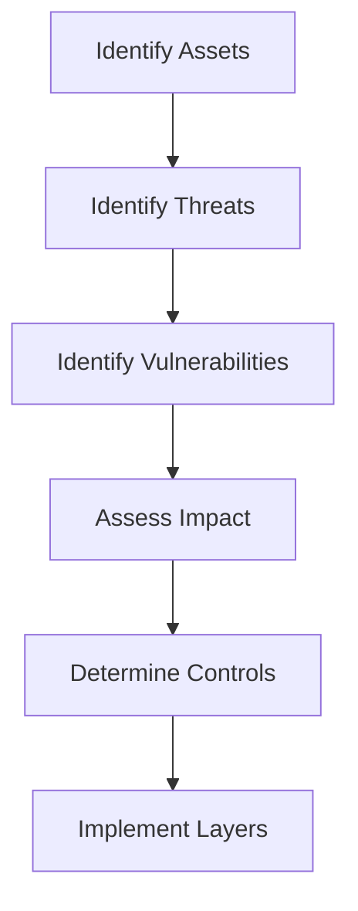

# Defense in Depth Principle

## Overview

Defense in Depth is a security strategy that implements multiple layers of security controls throughout an information system. Rather than relying on a single defensive mechanism, this approach creates overlapping protection layers so that if one control fails, others continue to provide protection. This strategy addresses the reality that no single security control is infallible.

## Core Layers

### Physical Layer
- **Facility Security**: Secure data centers and access controls
- **Hardware Security**: Tamper-resistant hardware and secure boot
- **Environmental Controls**: Fire suppression, climate control, backup power

### Network Layer
- **Perimeter Security**: Firewalls, intrusion detection/prevention systems
- **Network Segmentation**: VLANs, subnets, and micro-segmentation
- **Traffic Monitoring**: Deep packet inspection and anomaly detection

### Host Layer
- **Operating System Security**: Hardened configurations and patch management
- **Endpoint Protection**: Antivirus, endpoint detection and response (EDR)
- **Access Controls**: User authentication and authorization

### Application Layer
- **Input Validation**: Sanitize and validate all user inputs
- **Authentication & Authorization**: Multi-factor authentication and RBAC
- **Session Management**: Secure session handling and timeout policies

### Data Layer
- **Encryption**: Data at rest, in transit, and in use
- **Data Loss Prevention (DLP)**: Prevent unauthorized data exfiltration
- **Backup and Recovery**: Secure backups with integrity verification

## Implementation Strategy

### Layer 1: Physical Security
```yaml
# Example: Secure facility access control
facility_access_policy:
  authentication:
    - biometric_scanning
    - rfid_cards
    - pin_codes
  authorization:
    - role_based_access
    - time_restricted_access
    - dual_person_rule_for_sensitive_areas
  monitoring:
    - cctv_surveillance
    - intrusion_detection
    - access_logging
```

### Layer 2: Network Security
```nginx
# Example: Multi-layer network security with NGINX
# External firewall rules
firewall_rules:
  - action: deny
    source: any
    destination: sensitive_ports
    protocol: any

# Web Application Firewall (WAF)
waf_rules:
  - rule: sql_injection_prevention
    action: block
    severity: high
  - rule: xss_prevention
    action: block
    severity: high

# Internal network segmentation
network_policies:
  - name: web_to_app_isolation
    source: web_tier
    destination: app_tier
    allowed_ports: [8080, 8443]
```

### Layer 3: Host Security
```bash
# Example: System hardening script
#!/bin/bash

# Disable unnecessary services
systemctl disable unused_service
systemctl stop unused_service

# Configure firewall
ufw enable
ufw default deny incoming
ufw default allow outgoing
ufw allow ssh
ufw allow http
ufw allow https

# Install security updates
apt update && apt upgrade -y

# Configure audit logging
auditctl -w /etc/passwd -p wa -k identity
auditctl -w /etc/shadow -p wa -k identity

# Set secure permissions
chmod 600 /etc/shadow
chmod 644 /etc/passwd
```

### Layer 4: Application Security
```javascript
// Example: Multi-layer application security
const express = require('express');
const helmet = require('helmet');
const rateLimit = require('express-rate-limit');
const validator = require('validator');

const app = express();

// Security middleware layers
app.use(helmet()); // Security headers

// Rate limiting
const limiter = rateLimit({
  windowMs: 15 * 60 * 1000, // 15 minutes
  max: 100, // limit each IP to 100 requests per windowMs
  message: 'Too many requests from this IP, please try again later.'
});
app.use(limiter);

// Input validation and sanitization
app.post('/user', (req, res) => {
  const { email, password } = req.body;

  // Layer 1: Input validation
  if (!email || !password) {
    return res.status(400).json({ error: 'Email and password required' });
  }

  // Layer 2: Input sanitization
  const sanitizedEmail = validator.normalizeEmail(email);
  if (!validator.isEmail(sanitizedEmail)) {
    return res.status(400).json({ error: 'Invalid email format' });
  }

  // Layer 3: Business logic validation
  if (password.length < 8) {
    return res.status(400).json({ error: 'Password too short' });
  }

  // Process validated input
  createUser(sanitizedEmail, password);
});
```

### Layer 5: Data Security
```javascript
// Example: Comprehensive data protection
const crypto = require('crypto');
const AWS = require('aws-sdk');

class DataProtectionManager {
  constructor() {
    this.kms = new AWS.KMS();
    this.s3 = new AWS.S3();
  }

  // Encrypt data at rest
  async encryptData(data) {
    const keyId = await this.createDataKey();
    const cipher = crypto.createCipher('aes-256-gcm', keyId);
    let encrypted = cipher.update(JSON.stringify(data), 'utf8', 'hex');
    encrypted += cipher.final('hex');
    return {
      encrypted,
      keyId,
      tag: cipher.getAuthTag()
    };
  }

  // Secure data transmission
  async transmitSecurely(data, recipient) {
    // Encrypt for transmission
    const encrypted = await this.encryptForTransmission(data, recipient.publicKey);

    // Sign the data
    const signature = await this.signData(data);

    return {
      payload: encrypted,
      signature,
      timestamp: Date.now()
    };
  }

  // Data Loss Prevention
  monitorDataAccess(data, context) {
    // Log access attempts
    this.logAccess(data.id, context.user, context.action);

    // Check for suspicious patterns
    if (this.detectAnomalousAccess(data, context)) {
      this.alertSecurityTeam(data, context);
      return false; // Block access
    }

    return true; // Allow access
  }
}
```

## Security Control Categories

### Preventive Controls
- **Access Controls**: Authentication, authorization, and accounting
- **Encryption**: Protect data confidentiality and integrity
- **Input Validation**: Prevent injection attacks and malformed data

### Detective Controls
- **Monitoring**: Log analysis and real-time alerting
- **Intrusion Detection**: Network and host-based detection
- **Integrity Checking**: File integrity monitoring

### Corrective Controls
- **Incident Response**: Defined procedures for handling breaches
- **Patch Management**: Regular security updates and patches
- **Backup Recovery**: Secure data restoration capabilities

### Deterrent Controls
- **Policies and Procedures**: Clear security guidelines
- **Awareness Training**: Security education for personnel
- **Visible Security**: Cameras, guards, and warning signs

## Risk Assessment Integration

### Threat Modeling


### Risk Mitigation Strategy
- **High-Impact Threats**: Multiple overlapping controls
- **Common Vulnerabilities**: Standardized protection layers
- **Emerging Threats**: Adaptive security measures

## Monitoring and Maintenance

### Continuous Monitoring
- **Security Information and Event Management (SIEM)**: Centralized logging and analysis
- **Security Orchestration, Automation, and Response (SOAR)**: Automated incident response
- **Regular Audits**: Periodic security assessments and penetration testing

### Control Effectiveness
- **Key Performance Indicators (KPIs)**:
  - Mean Time Between Failures (MTBF) for security controls
  - False positive/negative rates for detection systems
  - Incident response times and success rates

### Maintenance Procedures
- **Regular Updates**: Keep all security controls current
- **Configuration Management**: Track and validate security configurations
- **Change Management**: Assess security impact of system changes

## Common Challenges

### Complexity Management
- **Challenge**: Multiple security layers increase complexity
- **Solution**: Use automation and centralized management
- **Best Practice**: Document all controls and their interactions

### Performance Impact
- **Challenge**: Security controls can affect system performance
- **Solution**: Optimize controls and use hardware acceleration
- **Best Practice**: Balance security with operational requirements

### Cost Considerations
- **Challenge**: Implementing multiple layers is expensive
- **Solution**: Prioritize controls based on risk assessment
- **Best Practice**: Start with core controls and expand gradually

## Industry Standards and Frameworks

### NIST Cybersecurity Framework
- **Identify**: Asset management and risk assessment
- **Protect**: Security controls implementation
- **Detect**: Threat detection and monitoring
- **Respond**: Incident response and mitigation
- **Recover**: Business continuity and recovery

### ISO 27001
- **Information Security Management**: Systematic approach to security
- **Risk-Based Controls**: Controls based on identified risks
- **Continuous Improvement**: Regular assessment and updates

### CIS Controls
- **Basic Controls**: Fundamental security hygiene
- **Foundational Controls**: Intermediate security measures
- **Organizational Controls**: Advanced security practices

## Tools and Technologies

### Security Platforms
- **SIEM Systems**: Splunk, ELK Stack, IBM QRadar
- **Endpoint Protection**: CrowdStrike, Microsoft Defender, SentinelOne
- **Network Security**: Palo Alto Networks, Cisco ASA, Fortinet

### Automation Tools
- **Infrastructure as Code**: Terraform, Ansible, Puppet
- **Security Automation**: SOAR platforms, custom scripts
- **Compliance Automation**: Chef InSpec, OpenSCAP

## References

- [NIST Special Publication 800-53](https://nvlpubs.nist.gov/nistpubs/SpecialPublications/NIST.SP.800-53r5.pdf)
- [ISO/IEC 27001:2022](https://www.iso.org/standard/54534.html)
- [CIS Controls Version 8](https://www.cisecurity.org/controls/cis-controls-list)
- [OWASP Defense in Depth](https://owasp.org/www-community/Defense_in_Depth)