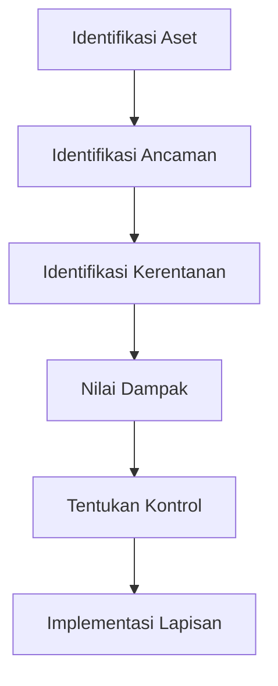

# Prinsip Defense in Depth

## Gambaran Umum

Defense in Depth adalah strategi keamanan yang mengimplementasikan multiple lapisan kontrol keamanan di seluruh sistem informasi. Daripada mengandalkan satu mekanisme pertahanan, pendekatan ini menciptakan perlindungan yang tumpang tindih sehingga jika satu kontrol gagal, kontrol lainnya tetap memberikan perlindungan. Strategi ini menjawab realitas bahwa tidak ada kontrol keamanan tunggal yang sempurna.

## Lapisan Inti

### Lapisan Fisik
- **Keamanan Fasilitas**: Data center yang aman dan kontrol akses
- **Keamanan Hardware**: Hardware tahan-tamper dan secure boot
- **Kontrol Lingkungan**: Penindasan kebakaran, kontrol iklim, daya cadangan

### Lapisan Jaringan
- **Keamanan Perimeter**: Firewall, sistem deteksi/prevensi intrusi
- **Segmentasi Jaringan**: VLAN, subnet, dan micro-segmentation
- **Monitoring Trafik**: Deep packet inspection dan deteksi anomali

### Lapisan Host
- **Keamanan Sistem Operasi**: Konfigurasi yang diperkeras dan manajemen patch
- **Perlindungan Endpoint**: Antivirus, endpoint detection and response (EDR)
- **Kontrol Akses**: Autentikasi dan otorisasi pengguna

### Lapisan Aplikasi
- **Validasi Input**: Sanitasi dan validasi semua input pengguna
- **Autentikasi & Otorisasi**: Multi-factor authentication dan RBAC
- **Manajemen Sesi**: Penanganan sesi yang aman dan kebijakan timeout

### Lapisan Data
- **Enkripsi**: Data saat istirahat, transit, dan penggunaan
- **Data Loss Prevention (DLP)**: Cegah eksfiltrasi data tidak sah
- **Backup dan Recovery**: Backup yang aman dengan verifikasi integritas

## Strategi Implementasi

### Lapisan 1: Keamanan Fisik
```yaml
# Contoh: Kontrol akses fasilitas yang aman
facility_access_policy:
  authentication:
    - biometric_scanning
    - rfid_cards
    - pin_codes
  authorization:
    - role_based_access
    - time_restricted_access
    - dual_person_rule_for_sensitive_areas
  monitoring:
    - cctv_surveillance
    - intrusion_detection
    - access_logging
```

### Lapisan 2: Keamanan Jaringan
```nginx
# Contoh: Keamanan jaringan multi-lapisan dengan NGINX
# Aturan firewall eksternal
firewall_rules:
  - action: deny
    source: any
    destination: sensitive_ports
    protocol: any

# Web Application Firewall (WAF)
waf_rules:
  - rule: sql_injection_prevention
    action: block
    severity: high
  - rule: xss_prevention
    action: block
    severity: high

# Segmentasi jaringan internal
network_policies:
  - name: web_to_app_isolation
    source: web_tier
    destination: app_tier
    allowed_ports: [8080, 8443]
```

### Lapisan 3: Keamanan Host
```bash
# Contoh: Script hardening sistem
#!/bin/bash

# Nonaktifkan layanan yang tidak perlu
systemctl disable unused_service
systemctl stop unused_service

# Konfigurasi firewall
ufw enable
ufw default deny incoming
ufw default allow outgoing
ufw allow ssh
ufw allow http
ufw allow https

# Install update keamanan
apt update && apt upgrade -y

# Konfigurasi audit logging
auditctl -w /etc/passwd -p wa -k identity
auditctl -w /etc/shadow -p wa -k identity

# Set permission yang aman
chmod 600 /etc/shadow
chmod 644 /etc/passwd
```

### Lapisan 4: Keamanan Aplikasi
```javascript
// Contoh: Keamanan aplikasi multi-lapisan
const express = require('express');
const helmet = require('helmet');
const rateLimit = require('express-rate-limit');
const validator = require('validator');

const app = express();

// Lapisan middleware keamanan
app.use(helmet()); // Header keamanan

// Rate limiting
const limiter = rateLimit({
  windowMs: 15 * 60 * 1000, // 15 menit
  max: 100, // batasi setiap IP ke 100 permintaan per windowMs
  message: 'Terlalu banyak permintaan dari IP ini, silakan coba lagi nanti.'
});
app.use(limiter);

// Validasi dan sanitasi input
app.post('/user', (req, res) => {
  const { email, password } = req.body;

  // Lapisan 1: Validasi input
  if (!email || !password) {
    return res.status(400).json({ error: 'Email dan password diperlukan' });
  }

  // Lapisan 2: Sanitasi input
  const sanitizedEmail = validator.normalizeEmail(email);
  if (!validator.isEmail(sanitizedEmail)) {
    return res.status(400).json({ error: 'Format email tidak valid' });
  }

  // Lapisan 3: Validasi logika bisnis
  if (password.length < 8) {
    return res.status(400).json({ error: 'Password terlalu pendek' });
  }

  // Proses input yang tervalidasi
  createUser(sanitizedEmail, password);
});
```

### Lapisan 5: Keamanan Data
```javascript
// Contoh: Perlindungan data komprehensif
const crypto = require('crypto');
const AWS = require('aws-sdk');

class DataProtectionManager {
  constructor() {
    this.kms = new AWS.KMS();
    this.s3 = new AWS.S3();
  }

  // Enkripsi data saat istirahat
  async encryptData(data) {
    const keyId = await this.createDataKey();
    const cipher = crypto.createCipher('aes-256-gcm', keyId);
    let encrypted = cipher.update(JSON.stringify(data), 'utf8', 'hex');
    encrypted += cipher.final('hex');
    return {
      encrypted,
      keyId,
      tag: cipher.getAuthTag()
    };
  }

  // Transmisi data yang aman
  async transmitSecurely(data, recipient) {
    // Enkripsi untuk transmisi
    const encrypted = await this.encryptForTransmission(data, recipient.publicKey);

    // Tandatangani data
    const signature = await this.signData(data);

    return {
      payload: encrypted,
      signature,
      timestamp: Date.now()
    };
  }

  // Data Loss Prevention
  monitorDataAccess(data, context) {
    // Log upaya akses
    this.logAccess(data.id, context.user, context.action);

    // Periksa pola mencurigakan
    if (this.detectAnomalousAccess(data, context)) {
      this.alertSecurityTeam(data, context);
      return false; // Blokir akses
    }

    return true; // Izinkan akses
  }
}
```

## Kategori Kontrol Keamanan

### Kontrol Preventif
- **Kontrol Akses**: Autentikasi, otorisasi, dan accounting
- **Enkripsi**: Lindungi kerahasiaan dan integritas data
- **Validasi Input**: Cegah serangan injeksi dan data malformed

### Kontrol Detektif
- **Monitoring**: Analisis log dan alerting real-time
- **Deteksi Intrusi**: Deteksi berbasis jaringan dan host
- **Pengecekan Integritas**: Monitoring integritas file

### Kontrol Korektif
- **Respons Insiden**: Prosedur terdefinisi untuk menangani kebocoran
- **Manajemen Patch**: Update keamanan reguler dan patch
- **Recovery Backup**: Kemampuan restorasi data yang aman

### Kontrol Deterren
- **Kebijakan dan Prosedur**: Panduan keamanan yang jelas
- **Pelatihan Awareness**: Edukasi keamanan untuk personel
- **Keamanan Terlihat**: Kamera, penjaga, dan tanda peringatan

## Integrasi Penilaian Risiko

### Threat Modeling


### Strategi Mitigasi Risiko
- **Ancaman Dampak Tinggi**: Kontrol yang tumpang tindih multiple
- **Kerentanan Umum**: Lapisan perlindungan standar
- **Ancaman Emerging**: Ukuran keamanan adaptif

## Monitoring dan Maintenance

### Monitoring Berkelanjutan
- **Security Information and Event Management (SIEM)**: Logging dan analisis terpusat
- **Security Orchestration, Automation, and Response (SOAR)**: Respons insiden otomatis
- **Audit Berkala**: Penilaian keamanan dan penetration testing berkala

### Efektivitas Kontrol
- **Key Performance Indicators (KPIs)**:
  - Mean Time Between Failures (MTBF) untuk kontrol keamanan
  - Tingkat false positive/negative untuk sistem deteksi
  - Waktu respons insiden dan tingkat kesuksesan

### Prosedur Maintenance
- **Update Berkala**: Jaga semua kontrol keamanan tetap terkini
- **Manajemen Konfigurasi**: Lacak dan validasi konfigurasi keamanan
- **Manajemen Perubahan**: Nilai dampak keamanan dari perubahan sistem

## Tantangan Umum

### Manajemen Kompleksitas
- **Tantangan**: Multiple lapisan keamanan meningkatkan kompleksitas
- **Solusi**: Gunakan otomasi dan manajemen terpusat
- **Praktik Terbaik**: Dokumentasikan semua kontrol dan interaksinya

### Dampak Performa
- **Tantangan**: Kontrol keamanan dapat memengaruhi performa sistem
- **Solusi**: Optimalkan kontrol dan gunakan akselerasi hardware
- **Praktik Terbaik**: Seimbangkan keamanan dengan kebutuhan operasional

### Pertimbangan Biaya
- **Tantangan**: Mengimplementasi multiple lapisan mahal
- **Solusi**: Prioritaskan kontrol berdasarkan penilaian risiko
- **Praktik Terbaik**: Mulai dengan kontrol inti dan ekspansi bertahap

## Standar dan Framework Industri

### NIST Cybersecurity Framework
- **Identify**: Manajemen aset dan penilaian risiko
- **Protect**: Implementasi kontrol keamanan
- **Detect**: Deteksi ancaman dan monitoring
- **Respond**: Respons insiden dan mitigasi
- **Recover**: Kontinuitas bisnis dan recovery

### ISO 27001
- **Information Security Management**: Pendekatan sistematis untuk keamanan
- **Risk-Based Controls**: Kontrol berdasarkan risiko teridentifikasi
- **Continuous Improvement**: Penilaian dan update berkala

### CIS Controls
- **Basic Controls**: Higiene keamanan fundamental
- **Foundational Controls**: Ukuran keamanan intermediate
- **Organizational Controls**: Praktik keamanan lanjutan

## Tools dan Teknologi

### Platform Keamanan
- **SIEM Systems**: Splunk, ELK Stack, IBM QRadar
- **Endpoint Protection**: CrowdStrike, Microsoft Defender, SentinelOne
- **Network Security**: Palo Alto Networks, Cisco ASA, Fortinet

### Tools Otomasi
- **Infrastructure as Code**: Terraform, Ansible, Puppet
- **Security Automation**: Platform SOAR, script kustom
- **Compliance Automation**: Chef InSpec, OpenSCAP

## Referensi

- [NIST Special Publication 800-53](https://nvlpubs.nist.gov/nistpubs/SpecialPublications/NIST.SP.800-53r5.pdf)
- [ISO/IEC 27001:2022](https://www.iso.org/standard/54534.html)
- [CIS Controls Version 8](https://www.cisecurity.org/controls/cis-controls-list)
- [OWASP Defense in Depth](https://owasp.org/www-community/Defense_in_Depth)